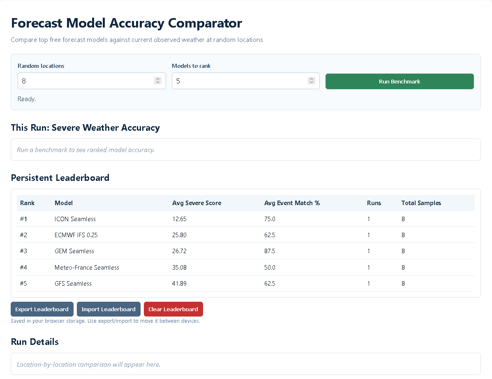

# Weather Forecast Model Comparison

A static web app that benchmarks free weather forecast models by comparing each model's forecast against current observed conditions across a random set of locations.

The app uses Open-Meteo APIs directly from the browser and ranks models by aggregate error.

## Screenshot



## What It Does

1. Selects a random list of locations from a built-in pool.
2. Detects which configured Open-Meteo forecast models are currently available.
3. Fetches:
   - Current observations (`temperature_2m`, `relative_humidity_2m`, `wind_speed_10m`)
   - Forecast values for each available model
4. Computes per-model error metrics.
5. Ranks models by a composite accuracy score (lower is better).
6. Shows full location-by-location details.

## Forecast Models (Candidate Set)

The app attempts to use these Open-Meteo model IDs and keeps the ones currently available:

- `ecmwf_ifs025`
- `gfs_seamless`
- `icon_seamless`
- `gem_seamless`
- `meteofrance_seamless`
- `jma_seamless`
- `ukmo_seamless`
- `ecmwf_aifs025`

## Scoring

For each model and location, absolute error is calculated for:

- Temperature (degC)
- Relative humidity (%)
- Wind speed (km/h)

Composite error is a normalized weighted average:

- `tempErr / 15`
- `humidityErr / 40`
- `windErr / 10`

Then multiplied by 100 for readability.

The final ranking is based on average composite error across sampled locations.

## Project Structure

```text
weather-model-comparison/
|-- index.html
|-- style.css
|-- script.js
|-- README.md
```

## Run Locally

No build step is required.

1. Clone repo:
   ```bash
   git clone https://github.com/TrentPierce/weather-model-comparison.git
   cd weather-model-comparison
   ```
2. Open `index.html` directly in a browser, or run a local static server:
   ```bash
   python -m http.server 8000
   ```
3. Open `http://localhost:8000`.

## Deploy

This is a static site, so it works with Vercel, Netlify, GitHub Pages, and similar hosts.

### Vercel

- Connect the repo in Vercel.
- Deploy with default static settings.
- Any push to the tracked branch (for example `main`) triggers a rebuild.

## Usage

1. Set **Random locations** (3 to 20).
2. Set **Models to rank** (2 to 8).
3. Click **Run Benchmark**.
4. Review:
   - Ranked model table
   - Per-location model comparison details

## Notes and Limitations

- The benchmark uses current observations as reference and short-horizon forecast values from model hourly output.
- Model availability can vary by time/location/API status.
- Results are probabilistic for small samples; increase location count for more stable rankings.
- API/network limits can affect run completeness.

## License

MIT
